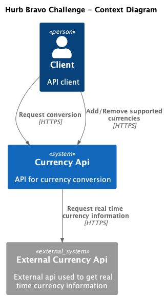
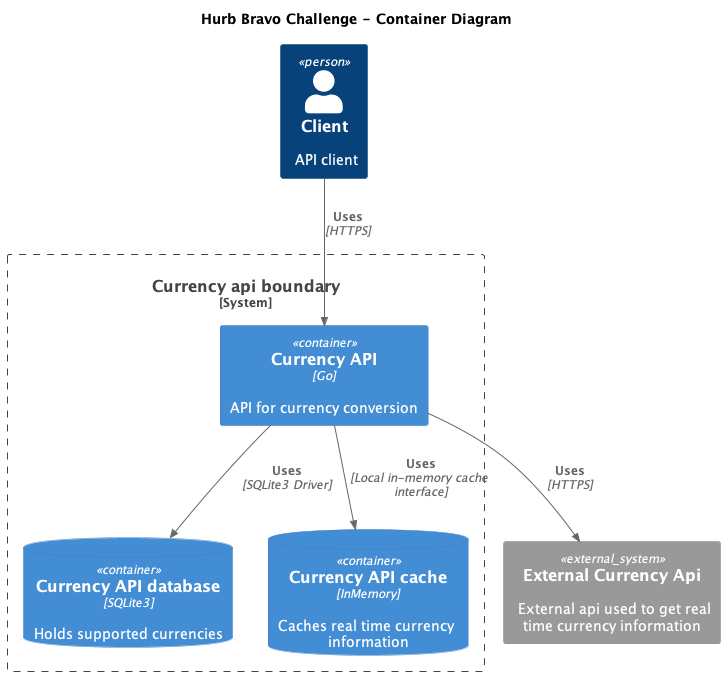

# Bravo challange

This project was inspired by the challenge proposed by [hurb](https://www.hurb.com/) available [here](https://github.com/hurbcom/challenge-bravo). 

## C4 Model Diagramas

An overview of the application can be seen through the context diagram, while the container diagram demonstrates in more detail how the solution was structured.

### Context layer diagram

<p align="center">
    
</p>

### Container layer diagram

<p align="center">
    
</p>


## How to play with it?

### To run api
In your terminal, after clone this repository, run:

```sh
docker compose up -d
```

To populate the database, just run the command:

```sh
docker exec bravo-challenge-api /bin/sh -c "touch db.sqlite && sqlite3 db.sqlite < init.sql"
```

After that the API will be accessible at `http://localhost:8000`


Some example requests can be found in the `client` folder.

### To run tests

```sh
docker compose up -d
```

```
docker exec bravo-challenge-api go test ./... -v
```

## Goals and decisions

During the implementation of the solution presented here, my main focus was to study the applicability of some concepts in Go, such as design patterns, tests and clean architecture.

For this reason, I deprioritized some items that I think are important for a more efficient solution, namely:

- Choosing another sql database instead of sqlite
- Choosing another caching mechanism instead of local inmemory caching
- Floating point calculations with precision techniques